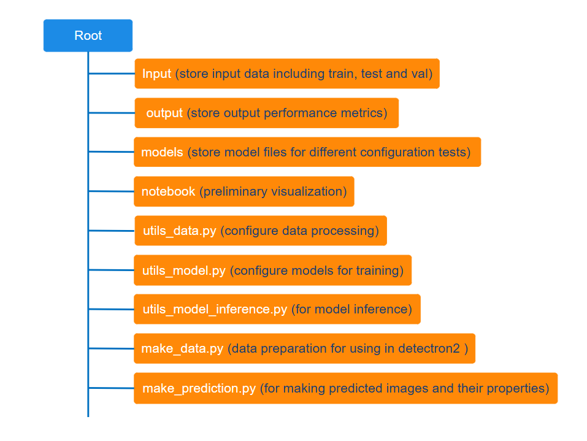

<details>
  <summary>Table of Contents</summary>
  <ol>
    <li>
      <a href="#introduction">Introduction</a>
    </li>
    <li><a href="#technical-tools">Technical Tools</a></li>
    <li><a href="#data-source">Data source</a></li>
    <li><a href="#data-processing">Data processing</a></li>
    <li><a href="#the-design">The design</a></li>
    <li><a href="#results">Results</a></li>
    <li><a href="#how-to-use-the-source-code">How to use the source code</a></li>    
    <li><a href="#reference">Reference</a></li>
  </ol>
</details>

### Introduction

This repository hosts the source code for an instance segmentation project, focusing on segmenting mitochondria in microscopic images. Detectron2 <a href="https://github.com/facebookresearch/detectron2/blob/main/README.md"> (Wu et al., 2019) </a> has been utilized as the primary tool for this task.

### Technical tools

The orginal paper of Detectron2 <a href="https://github.com/facebookresearch/detectron2/blob/main/README.md"> (Wu et al., 2019) </a>.

The application documentation of <a href="https://detectron2.readthedocs.io/en/latest/"> Detectron2 </a> by Facebook research.

-   Pytorch
-   Detectron2
-   Opencv
-   numpy
-   pandas
-   scikit-image
-   leafmap
-   matplotlib
-   seaborn
-   Docker

### Data source

This project utilizes an electron microscopy image dataset from the CA1 area of the hippocampus, annotated for mitochondria by highly trained researchers. For more information and access to the dataset, visit the <a href="https://www.epfl.ch/labs/cvlab/data/data-em/"> Electron Microscopy Dataset</a>.

### Data processing

The original dataset came in the format of TIF images. To facilitate data processing, I created 2 Python classes called DataHandler and AnnotationHandler, which incorporates and also refines functions originally from <a href="https://www.youtube.com/watch?v=NYeJvxe5nYw"> Bhattiprolu, S., 2023</a>. The primary purpose of DataHandler and AnnotationHandler is to transform these TIF images into PNG format, and prepare annotation data in COCOJSON format as a necessary step for their use with Detectron2.

The usage of DataHandler and AnnotationHandler

```python
# ________________ HANDLE DATA ________________ #
DataHandler("train", train_path, classes)
DataHandler("test", test_path, classes)
# ________________ HANDLE ANNOTATIONS ________________ #
AnnotationHandler("train", path_to_train_masks, classes, category_ids)
AnnotationHandler("test", path_to_test_masks, classes, category_ids)
```

### The design



The above diagram illustrates the fundamental architecture of this project. Below, you will find an example outline detailing the code setups necessary for experimenting with various configurations of Detectron2 for this specific task.

Model configuration for experiment was done in the file detectron2_1.py with the outline of code structure as follows:

```python
# ________________ MAKE TRAIN DATA READY FOR TRAINING ________________ #
...

# ****** --------- ****** #
test_name = "test0"
note = ""
# ****** --------- ****** #

model = "COCO-InstanceSegmentation/mask_rcnn_R_50_FPN_1x.yaml"
# ________________ MODEL CONFIGURAITON FOR EXPERIMENT ________________ #
...

trainer.train()  # Start the training process

# ________________ MAKE COCO METRICS EVALUATION ________________ #
...
# ________________ SAVE COCO METRICS TO JSON ________________ #
...
# ________________ MAKE COCO METRICS TABLE AND SAVE TO .PNG ________________ #
...
# ________________ SAVE LOSS METRICS TO JSON ________________ #
...
# ________________ VISUALIZE LOSS METRICS ________________ #
...
# ________________ SAVE LOSS METRICS VISUALIZATION TO PNG ________________ #
...

```

After each experiment, model evaluation results were recorded in JSON and PNG files for comparision between different configurations.

### Results

<p align="center">
  
</p>

<p align="center">
  
</p>

<br>

This project involved numerous experiments, but only the most significant results are highlighted here.

<br>

<h6 align="center">
Model performance metrics
</h6>

<p align="center">
    
</p>

<p align="center">
    
</p>

<h6 align="center">
Visualization of prediction on an unseen image (name: test_001.png)
</h6>

<p align="center">
    
</p>

<br>

<h6 align="center">
Visualization of the ground truth for the predicted image (name: test_001.png)
</h6>

<p align="center">
    
</p>

<br>

While Detectron2 shows promise in handling medium-sized objects within images, its performance on smaller objects in a noisy dataset, like the one in this project, can be challenging. For more in-depth microscopic image analysis, tools like <a href="https://www.arivis.com/">Arivis</a> from Zeiss may offer superior capabilities. However, for instance segmentation applications in aquaculture, where there's less variance in object sizes, Detectron2 is very promising. An example of its practical application is monitoring the growth of sea cucumbers in aquaculture hatcheries, where its capabilities are well-aligned with the task requirements.

In a comparative experiment with this dataset, I evaluated both Detectron2 and YOLOv8. The results indicated that, for this particular task, Detectron2 demonstrated superior performance over YOLOv8 (see <a href="https://mito-app-651cbfda9bde.herokuapp.com/"> comparison images)</a>.

<br>

### How to use the source code

##### Using the source code for development

-   Fork/clone this repository (https://github.com/LeoUtas/Mitochondria_segmentation_research_detectron2.git).
-   First thing first, before proceeding, ensure that you are in the root directory of the project.
-   Get the docker container ready:

    -   Run docker build (it might take a while for installing all the required dependencies to your local docker image).

    ```cmd
    docker build -t <name of the docker image> .
    ```

    -   Run a docker container in an interactive mode (once the docker image is built, you can run a docker container).

    ```cmd
    docker run -it -v "$(PWD):/app" <name of the docker image> /bin/bash
    ```

    -   Now, it should be running inside the interactive mode of the docker container to explore the code functionalities.

    -   The detectron2_1.py file is responsible for training the model. Upon completion of the training process, a folder named after the test specified at line 43 of detectron2_1.py is generated within the models/ directory. This folder contains the trained results. However, to comply with GitHub's file size restrictions, the trained results are not synchronized between the remote and local versions of this project.

    ```python
    # ****** --------- ****** #
    test_name = "name of the test"
    note = ""
    # ****** --------- ****** #
    ```

    -   Note: a quick and easy way to test model training is to run the file detectron2_1.py using CPU, for this purpose it requires to make use of the line 74 in detectron2_1.py. However, training a computer vision on CPU is not efficient. It is highly recommended to forlow instructions in <a href="https://detectron2.readthedocs.io/en/latest/tutorials/install.html"> detectron2 installation </a> and <a href="https://pytorch.org/"> pytorch installation </a> for setting up the model training using GPU.

    ```python
    # cfg.MODEL.DEVICE = "cpu"
    ```

    -   When you're done, you can simply type "exit" to escape the development environment

    ```
    exit
    ```

-   Also, stop running the container when you're done:

```cmd
docker stop <name of the container>
```
I'm excited to share this repository! Please feel free to explore its functionalities. Thank you for this far. Have a wonderful day ahead!

Best,
Hoang Ng

### Reference

Bhattiprolu, S. (2023, Sep 20). 332 - All about image annotations​ [Video]. YouTube. https://www.youtube.com/watch?v=NYeJvxe5nYw

Wu, Y., Kirillov, A., Massa, F., Lo, W.-Y., & Girshick, R. (2019). Detectron2. Retrieved from https://github.com/facebookresearch/detectron2
